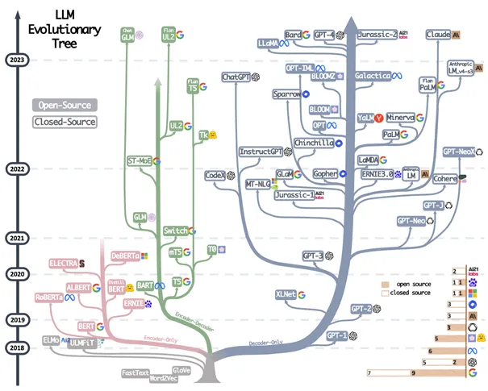

# CS-TAG  
CS-TAG is a project to share the public text-attributed graph (TAG) datasets and benchmark the performance of the different baseline methods.
We welcome more to share datasets that are valuable for TAGs research.


## Datasets 🔔
We collect and construct 8 TAG datasets from ogbn-arxiv, amazon, dblp and goodreads.
Now you can go to the 'Files and version' in [CSTAG](https://huggingface.co/datasets/Sherirto/CSTAG/tree/main) to find the datasets we upload!
In each dataset folder, you can find the **csv** file (which save the text attribute of the dataset), **pt** file (which represent the dgl graph file), and the **Feature** folder (which save the text embedding we extract from the PLM).
You can use the node initial feature we created, and you also can extract the node feature from our code. 
For a more detailed and clear process, please [clik there.😎](FeatureExtractor/README.md)

## Environments
You can quickly install the corresponding dependencies
```shell
conda env create -f environment.yml
```

## Pipeline 🎮
We describe below how to use our repository to perform the experiments reported in the paper. We are also adjusting the style of the repository to make it easier to use.
(Please complete the ['Datasets and Feature part'](FeatureExtractor/README.md) above first)
### 1. GNN for Node Classification/Link Prediction
You can use 'ogbn-arxiv', 'Children', 'History', 'Fitness', 'Photo', 'Computers', 'webkb-cornell', 'webkb-texas', 'webkb-washington' and 'webkb-wisconsin' for the '**--data_name**'.
```python
python GNN/GNN.py --data_name=Photo --dropout=0.2 --lr=0.005 --model_name=SAGE --n-epochs=1000 --n-hidden=256 --n-layers=3 --n-runs=5 --use_PLM=data/CSTAG/Photo/Feature/Photo_roberta_base_512_cls.npy
```
```python
python GNN/GNN_Link.py --use_PLM=data/CSTAG/Photo/Feature/Photo_roberta_base_512_cls.npy --path=data/CSTAG/Photo/LinkPrediction/ --graph_path=data/CSTAG/Photo/Photo.pt --gnn_model=GCN
```

### 2. PLM for Classification Tasks
```python
CUDA_VISIBLE_DEVICES=0,1 /usr/bin/env python sweep/dist_runner.py LMs/trainLM.py --att_dropout=0.1 --cla_dropout=0.1 --dataset=Computers_RS --dropout=0.1 --epochs=4 --eq_batch_size=180 --eval_patience=20000 --grad_steps=1 --label_smoothing_factor=0.1 --lr=4e-05 --model=Deberta --per_device_bsz=60 --per_eval_bsz=1000 --train_ratio=0.2 --val_ratio=0.1 --warmup_epochs=1 --gpus=0,1 --wandb_name OFF --wandb_id OFF 
```

### 3. TMLM for PreTraining

### 4. TDK for PreTraining 

### 5. TCL for PreTraining 
```python
CUDA_VISIBLE_DEVICES=0,1 /usr/bin/env python sweep/dist_runner.py LMs/Train_Command/train_CL.py --PrtMode=TCL --att_dropout=0.1 --cla_dropout=0.1 --dataset=Photo_RS --dropout=0.1 --epochs=5 --eq_batch_size=60 --per_device_bsz=15 --grad_steps=2 --lr=5e-05 --model=Bert --warmup_epochs=1 --gpus=0,1 --cache_dir=exp/TCL/Photo/Bert_base/
```
### 6. TMDC for Training 


## Create Your Model
If you want to add your own model to this code base, you can follow the steps below:

Add your GNN model:
1. In GNN/model/GNN_library, define your model (you can refer to the code for models like GCN, GAT, etc.)
2. In the args_init() function in GNN/model/GNN_arg.py, check to see if it contains all the parameters involved in your model. If there are deficiencies, you can easily add new parameters to this function.
3. Import the model you defined in GNN/GNN.py and add your corresponding model to the gen_model() function. You can then run the corresponding code to perform the node classification task.

Add your PLM model:
1. Go to the LM/Model/ path and create a folder named after your model name. Define __init__.py and config.py in it (see how these two files are defined in other folders).
2. Add the parameters you need to the parser() function in lm_utils.
3. If your model can't be loaded from huggingface, please pass in the path to the folder your model corresponds to via the parameter 'pretrain_path'.


## Main experiments in CS-TAG
Representation learning on the TAGs often depend on the two type models: Graph Neural Networks and Language Models.
For the latter, we often use the Pretrained Language Models (PLMs) to encode the text.
For the GNNs, we follow the [DGL](https://www.dgl.ai/) toolkit and implement them in the GNN library.
For the PLMs, we follow the [huggingface](https://huggingface.co/) trainer to implement the PLMs in a same pipeline.
We know that there are no absolute fair between the two type baselines.

[//]: # (We use the [wandb]&#40;https://wandb.ai/site&#41; to log the results of our experiments.)

[//]: # (We make public the logs of some of our experiments done and organized to promote more researchers to study TAG.)

[//]: # (- [x] [Node classification from GNN]&#40;https://wandb.ai/csu_tag/OGB-Arxiv-GNN/reports/GNN-Accuracy--Vmlldzo0MjcyMzk4&#41;)

[//]: # (- [x] [LM related in Ele-computers]&#40;https://wandb.ai//csu_tag/Computers/reports/Ele-Computers--Vmlldzo0NjMxNTA4&#41;)

### Future work
In the CS-TAG, we mainly explore the form of classification tasks on TAGs, so we mainly use the mask language models.
But in recent years, the autoregressive language models have recently evolved rapidly, with models with increasingly larger and models that work increasingly well on the generative tasks.

To this end, in the future we will explore some suitable forms of generative tasks on TAGs to analyze the performance performance of different large language models(ChatGPT, GPT-4, LLaMA, and so on.).


[//]: # (```bash)

[//]: # (./GNN                )

[//]: # (|---- model/                )

[//]: # (|        |---- Dataloader.py    # Load the data from CS-TAG     	)

[//]: # (|        |---- GNN_arg.py       # GNN settings &#40;e.g. dropout, n-layers, n-hidden&#41;)

[//]: # (|        |---- GNN_library.py   # CS-TAG GNN baselines&#40;e.g., mlp, GCN, GAT&#41;)

[//]: # (|---- GNN.py                    # .py for node classification task)

[//]: # (|---- GNN_Link.py                    # .py for link prediction task)

[//]: # (./LMs)

[//]: # (|---- Model/)

[//]: # (|        |---- Bert    # Save the config for the TinyBert, Bert-base and Bert-large)

[//]: # (|        |---- Deberta    # Save the config for the Deberta-base and Deberta-large)

[//]: # (|        |---- Distilbert    # Save the config for the Distilbert)

[//]: # (|        |---- Electra    # Save the config for the Electra-small, Electra-base and Electra-large)

[//]: # (|---- Train_Command/)

[//]: # (|        |---- Pretrain/    # Save the scripts for the topological pretraining )

[//]: # (|                |---- Scripts/    # Save the scripts for the topological pretraining )

[//]: # (|                       |---- TCL.sh   #  Scripts for the TCL)

[//]: # (|                       |---- TMLM.sh   #  Scripts for the TMLM)

[//]: # (|                       |---- TDK.sh   #  Scripts for the TDK)

[//]: # (|                       |---- TMDC.sh   #  Scripts for the TMDC)

[//]: # (|        |---- Co-Train.py    # .py for the Co-Training strategy)

[//]: # (|        |---- Toplogical_Pretrain.py    # .py for the toplogical pretraining strategy &#40;e.g., TCL,TDK,TMLM, TCL+TDK&#41;)

[//]: # (|---- Trainer/)

[//]: # (|        |---- Inf_trainer.py            # .py for getting node embedding from the PLMs)

[//]: # (|        |---- TCL_trainer.py            # Trainer &#40;following the huggingface&#41; for the TCL strategy)

[//]: # (|        |---- TDK_trainer.py            # Trainer &#40;following the huggingface&#41; for the TDK strategy)

[//]: # (|        |---- TMDC_trainer.py            # Trainer &#40;following the huggingface&#41; for the TMDC strategy)

[//]: # (|        |---- TLink_trainer.py            # Trainer &#40;following the huggingface&#41; for the TCL in the Link prediction tasks )

[//]: # (|        |---- lm_trainer.py                 # Trainer for node classification tasks)

[//]: # (|        |---- train_MLM.py                 #  .py for the TMLM tasks &#40;following the huggingface&#41;)

[//]: # (|---- utils/)

[//]: # (|        |---- data/    # Save the scripts for the topological pretraining )

[//]: # (|                |---- data_augmentation.py # the .py for generating the corpus for the TMLM tasks)

[//]: # (|                |---- datasets.py #  The defined dataset class for different tasks)

[//]: # (|                |---- preprocess.py #  Some commands for preprocessing the data &#40;e.g. tokenize_graph, split_graph&#41;)

[//]: # (|        |---- function )

[//]: # (|                |---- dgl_utils.py   # Some commands from dgl )

[//]: # (|                |---- hf_metric.py   # Some metric used in this benchmark &#40;e.g. accuracy, f1&#41;)

[//]: # (|        |---- modules)

[//]: # (|                |---- conf_utils.py)

[//]: # (|                |---- logger.py)

[//]: # (|        |---- settings.py    # Some config for the datasets. You can creat your dataset in this file!  )

[//]: # (|---- model.py       # Define the model for the donstream tasks)

[//]: # (|---- lm_utils.py    # Define the config for the PLM pipeline)

[//]: # (|---- trainLM.py     # Running for the node classification tasks)

[//]: # (|---- dist_runner.py  # Parallel way to training the model)

[//]: # (```)

